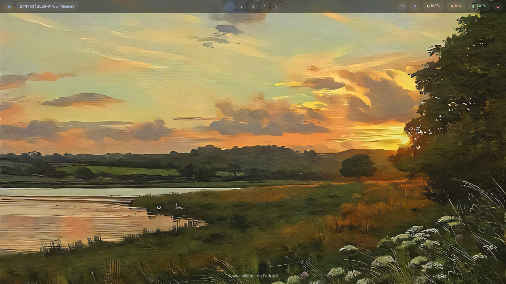
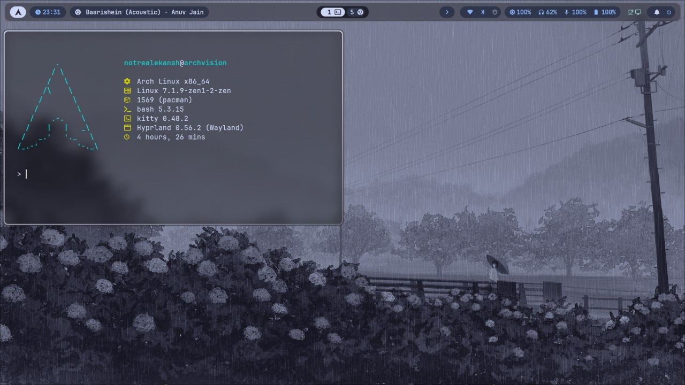
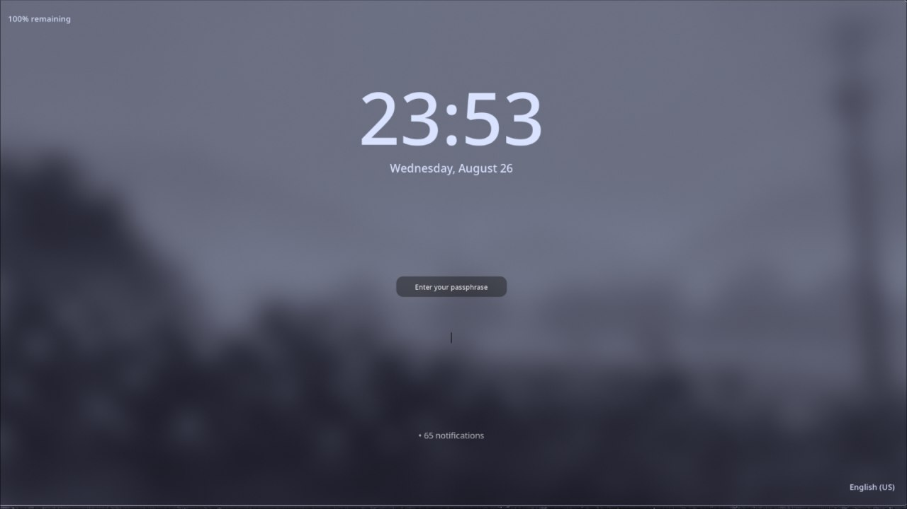
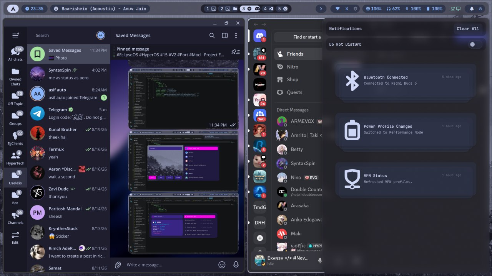

# Hyprland Rice

<p align="center"></p>

<p align="center"><strong>A modular Hyprland desktop project for Arch Linux.</strong><br>
Lua compositor configuration, Waybar, Rofi, Hyprlock, Hyprpaper, SwayNC, terminals, wallpapers, and a reversible installer.</p>



## Features

- Modular Hyprland Lua entry point with separate environment, monitor, appearance, animation, input, keybind, rule, and startup modules.
- A guided installer that detects the host, checks connectivity, asks about every optional feature, logs work, backs up existing files, and rolls back on failure.
- Purpose-based package manifests instead of one opaque dependency list.
- Curated Waybar modules, Rofi launcher styling, Hyprlock screen, Hyprpaper wallpaper flow, SwayNC notifications, Kitty/Alacritty terminals, and bundled assets.
- Merge, replace, or skip existing configuration trees without silently overwriting them.

## Screenshots




| Lockscreen | Tiling |
| --- | --- |
|  |  |
> [!TIP]
> Helpful advice see [docs/screenshot](docs/screenshots/) for more views.

## Installation

The supported automated target is Arch Linux or an Arch-like system with `pacman`. Clone the repository, inspect the plan, and run:

```bash
git clone https://github.com/realekansh/Hyprland-Rice.git
cd Hyprland-Rice
./install.sh
```

Use `./install.sh --dry-run` to inspect detection and package selections without changing the system. Read the [documentation index](docs/README.md) before installing on a working desktop.

The installer does not modify the bootloader, kernel, display manager, or unrelated data. It does install selected packages and may copy files into `$HOME`; those actions are shown interactively and recorded in `logs/`.

## Documentation

- [Architecture](docs/architecture/overview.md) · [Components](docs/components/hyprland.md) · [Customization](docs/customization/appearance.md)
- [Keybindings](docs/workflow/keybindings.md) · [Scripts](docs/workflow/scripts.md) · [Wallpapers](docs/workflow/wallpapers.md)
- [Troubleshooting](docs/troubleshooting/common-issues.md) · [Documentation Index](docs/README.md) · [Changelog](CHANGELOG.md)

## Supported systems

Automated package installation is intentionally Arch-first because the active update utilities, package names, and AUR integration are Arch-specific. Other distributions are detected and rejected safely; their package lists can be ported manually using the documentation in [docs/](docs/README.md).

## Repository structure

```text
config/       Installed desktop configuration trees
packages/     Purpose-based Arch package manifests
scripts/      Installer modules
assets/       Screenshots, wallpapers, and branding
docs/         Project documentation
logs/         Runtime installer logs (ignored by Git)
```

## Credits and license

Built around [Hyprland](https://hypr.land/), Wayland, Waybar, Rofi, SwayNC, and the wider Linux desktop ecosystem. The banner and visual identity are credited to [SyntaxSpin](https://github.com/SyntaxSpin). The project is released under the [MIT License](LICENSE).
